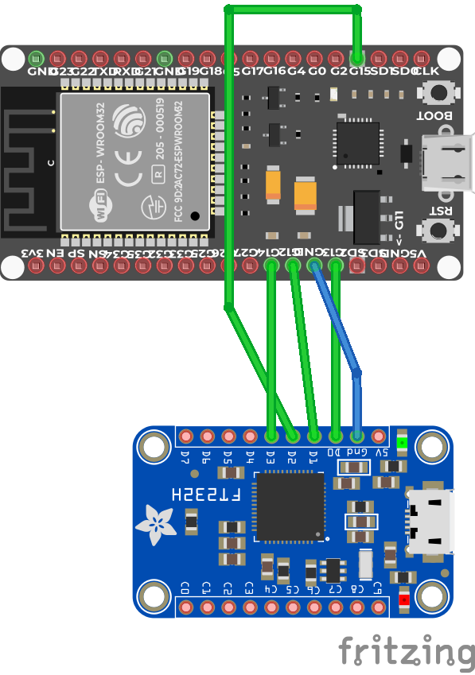

# ESP32 JTAG Debugging

## wiring

| JTAG | FT232H | ESP32  |
| ---- | ------ | ------ |
| TDI  | ADBUS1 | GPIO12 |
| TDO  | ADBUS2 | GPIO15 |
| TCK  | ADBUS0 | GPIO13 |
| TMS  | ADBUS3 | GPIO14 |
| TRST | -      | -      |

## fritzing

- FT232HL https://github.com/adafruit/Fritzing-Library/blob/master/parts/Adafruit%20FT232H%20Breakout.fzpz
- ESP32 Dev Kit C https://forum.fritzing.org/t/fritzing-part-of-an-esp32/5355/3
  K
